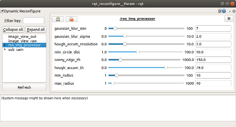
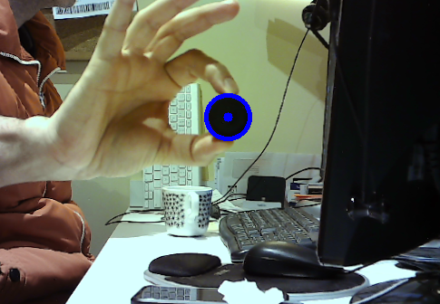

## ros_img_processor
Just a simple template node receiving an image and doing something. Links to OpenCV and ROS wrapped.

## How to run the code
In a terminal window, type:
```sh
$ roslaunch ros_img_processor ros_img_processor.launch
```

## Tip
Check your webcam encodings (yuyv,mjpeg,...) and set them accordingly at file launch/usb_camera.launch

## Perception Exercise 2.2

### Solution
The job was mostly filling the function: ```void RosImgProcessorNode::process()``` with the same code done before in previous exercise 1.4 of the circle detector. Basically, you first blur a little bit the image and then run it through a Hough Transform.

In my code, in case more than one circle is detected in the image, I only use the first one. Tuning the parameters correctly for the object you are testing will however result in only one circle detected most of the times. Once you have the position of the detected circle, you can obtain the direction with

 ```direction_ = matrixK_.inverse() * point;```

### Parameters of the Circle Detector
Getting to work correctly the circle detector can be a little tricky. Since I was trying different parameters to find the correct values, I needed to recompile each time I wanted to try new values.

My first solution was to save these parameters in a yaml file and load this file in the same launch file. This saved me the trouble to recompile, but still I needed to shutdown all nodes and relaunch them, which is still a bit tedious.

So I decided to implement a simple dynamic_reconfigure server that allows to modify the parameters on the fly. For that, I followed the tutorials 1) and 3) from this link: http://wiki.ros.org/dynamic_reconfigure/Tutorials



### Output


